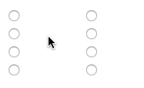

# WhipLinker

Connect items visually by drawing whips/links/cables/connectors between them

## Usage

	new WhipLinker(<sourceElementOrSelector>, <targetElementOrSelector>[, <options>]);

See `index.html` for more a detailed usage example.

## License

MIT
